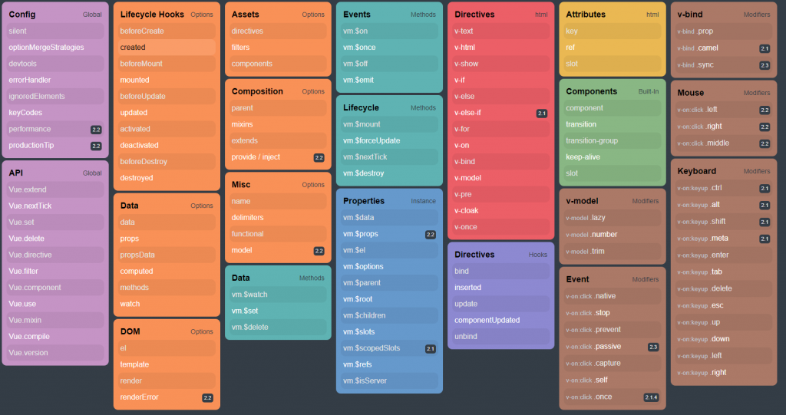

# Vue.js


Is a progressive javascript framework, is a framework for build user interfaces, is approachable, versatile, performant, maintainable and testable

## To use vue in a project

In the body of the index.html add

```html
<script src="https://cdn.jsdelivr.net/npm/vue/dist/vue.js"></script>
```

---

## Ton install vue cli

Vue cli is a standard tool for vue development

[official site](https://cli.vuejs.org/)

1. Install node.js for make the automatic building of the vue project, [here](https://nodejs.org/es/download/)

2. Inatall the vue cli

```bash
npm install -g @vue/cli
```

3. Create the project with

```bash
vue create PROJECT_NAME
```

4. Enter in the folder

```bash
cd PROJECT_NAME
```

5. To run the project execute

```bash
npm run serve
```

## Initial files

- node_modules = folder with the dependencies of node
- public = folder with the public files of the project, and generate the static code of the project
  - favicon.ico = vue icon
  - index.html = html file in where all components are rendered
- src = folder with the source code
  - assets = folder with the resources of the project
    - logo.png = image of vue
  - components = folder with the components that make up the application
    - HelloWorld = component example
  - App.vue = single file component with the component example of the cli
  - main.js = import vue and declare the instance of vue
- .browserslistrc = configuration file
- .eslintrc.js = eslint configurations
- .gitignore = gitignore of git
- babel.config.js = babel configurations
- package.json = commands of the project and modules installed in the project
- package-lock.json = modules installed and the version of this

single file component = are the files that the framework allows create for work with the html, js and css in one file, then the cli create a file that the browser can understand

## User interface of vue cli

Generate a browser interface that allows watch the plugins, dependencies, change the configuration and the task.
To run the user interface run

```bash
vue ui
```

---

## Properties

### Declarative rendering

Use **two way data binding** fot synchronize the view and the state of the application

### Directives

Is a tool of vue that allows handle the dom of declarative form, that is to say, use tags inside the html elements to define behaviors.  
To use directives, you must put v-bind: before each attribute of the tag

### Data

Is a function that return an object

### Methods

Instance of view that allows define functions principally for the events

### Computed

Are functions that ever return a value, use computed properties (properties that are calculated in real time based in another properties)

### Watch

Are functions that execute a piece of code, the name of the function must correspond with the name of a property of data

### Modifiers

The modifiers execute code before an event. (v-on: or @)

### Component

Components are functions that allow register a new component, its allows create a new component for use all methods inside this component

```js
Vue.compnent("NAME_COMPONENT", {
  /*CODE*/
});
```



## Life cycle hooks

Vue allows use the methods of the lifecycle of the components that refer at the cycles of the components:

- beforeCreated
- created
- beforeMount
- mounted
- beforeUpdate
- updated
- beforeDestroy
- destroyed

---
